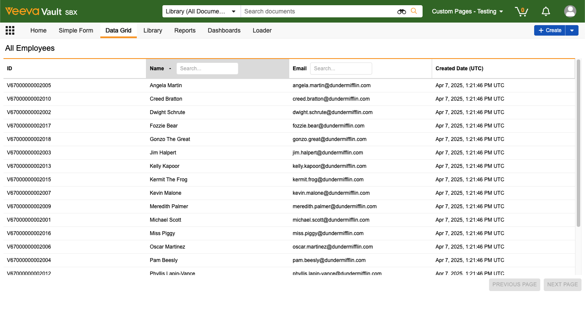

# Vault Custom Pages

This project contains an example [Vault Custom Page](https://developer.veevavault.com/custompages/) that displays 
Vault data in a grid, built using React and esbuild. Refer to the [Getting Started](https://developer.veevavault.com/custompages/#getting-started) 
section of our documentation for more information.

